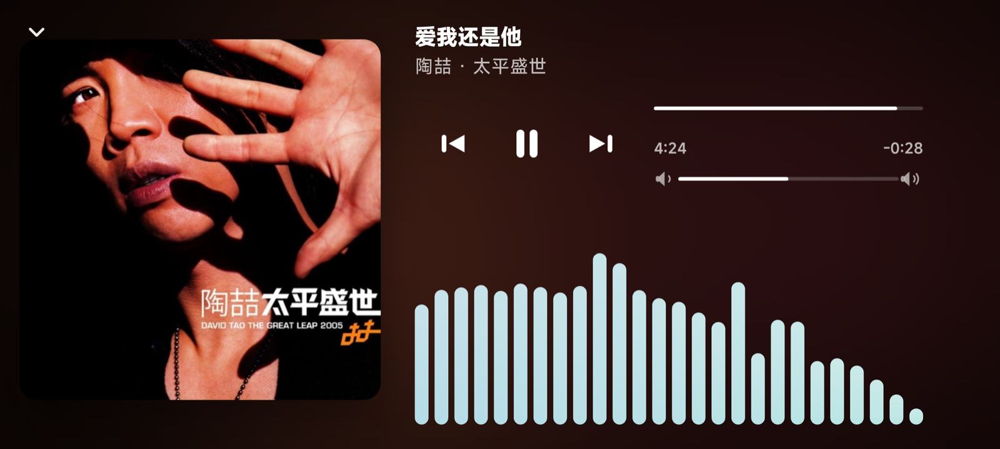

# Awesome Time

把电脑上正在播放的歌曲，镜像到手机上：封面、进度、播放控制，以及横屏实时频谱。

手机与电脑连同一 Wi-Fi 即可。进度在手机上本地插值，封面单独拉取，频谱走轻量推送，不会把界面卡住。

<p align="center">
  <br/>
  <sub>竖屏：封面取色背景、进度与播放控制</sub>
</p>

<p align="center">
  <br/>
  <sub>横屏：左侧封面与控制，右侧真实频谱音柱</sub>
</p>

## 能做什么

- 同步电脑当前曲目（歌名、歌手、专辑、封面）
- 进度条跟手拖动，暂停 / 上一首 / 下一首 / 音量
- 背景颜色跟着封面走
- 横屏显示系统音频的真实频谱（macOS 通过 ScreenCaptureKit 抓系统声音做 FFT）
- 没有电脑时可以用演示模式看界面

## 架构

```
电脑 Bridge (Python)  ← 局域网 →  Android Flutter 客户端
```

| 接口 | 作用 |
|------|------|
| `WS /ws` | 推送播放状态和频谱；接收控制命令 |
| `GET /artwork` | 单独拉封面，避免大图堵住频谱 |
| `GET /state` | HTTP 回退 |
| `POST /cmd` | HTTP 回退控制 |
| `GET /health` | 探活 |

电脑大约每 250ms 轮询一次元数据。进度由手机本地时钟按帧插值；切歌、播放状态变化时立刻推送，并每 2 秒校正一次位置。

## 1. 启动电脑桥接

```bash
python3 bridge/awesome_bridge.py
# 默认端口 8765，会打印局域网地址，例如 ws://192.168.1.10:8765/ws
```

```bash
python3 bridge/awesome_bridge.py --port 8765 --interval 0.25
```

桥接只用 Python 标准库，没有第三方依赖。

### macOS（推荐）

```bash
brew install nowplaying-cli
```

安装后能读系统 Now Playing（浏览器、音乐 App 等）。没装时回退到 Music / Spotify / Podcasts / VLC / IINA 的 AppleScript，以及浏览器标题启发式。

首次控制若弹权限：

- **系统设置 → 隐私与安全性 → 辅助功能 / 自动化**：给运行 bridge 的终端授权（播放、切歌）
- **系统设置 → 隐私与安全性 → 屏幕录制**：同样勾选终端（抓系统音频做频谱）。改完后重启 bridge

### Linux

有 `playerctl` 时可以读写多数播放器。

### Windows

桥接可以跑起来，系统媒体源目前支持较弱。

## 2. 运行手机客户端

手机和电脑在同一 Wi-Fi：

```bash
flutter pub get
flutter run
```

连接页填桥接地址，例如 `192.168.1.10:8765`，会自动走 WebSocket。也可以用 **演示模式**，不连电脑。

## 目录

```
awesome_time/
  lib/                 Flutter 客户端
  bridge/              桌面桥接
    awesome_bridge.py
    audio_tap.swift    macOS 系统音频 FFT
  shaders/             流动背景
  docs/screenshots/    界面截图
```

## 许可

个人项目，按原样提供。
